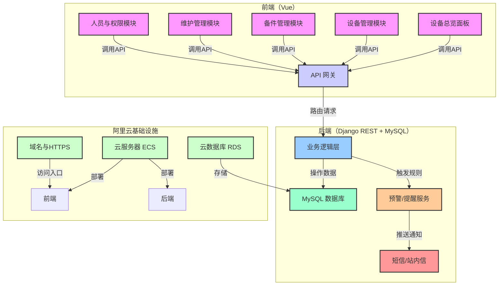

# 设备管理系统（Django REST + Vue + MySQL）方案文档

## 一、功能模块

### （一）前端模块（Vue 端）

1. **设备总览面板**
   - 设备状态统计：
     - 车间的Lay-out图，主要的工站显示状态；
     - 直观呈现设备在线、离线、故障的数量占比；
     - 展示维保任务完成进度看板；
     - 推送待办任务提醒；
   - 数据筛选与可视化：
     - 支持按设备类型、状态、所属部门等多维度筛选设备；通过echarts图表展示设备生命周期曲线、故障率趋势等数据。
2. **设备管理模块**
   - 设备档案管理：
     - 设备基础信息（名称、型号、厂商、购入时间、原值、位置、所属部门等）的增删改查操作；
     - 支持设备信息的批量导入与导出。
     - 设备子系统（较大型设备适用）
       - system - position -article
   - 设备状态监控：
     - 实时显示设备运行状态（在线、离线、故障）；
     - 当设备出现故障时，触发弹窗预警并可配置短信预警。
3. **备件管理模块**
   - 备件台账：
     - 备件名称
     - 型号
     - 库位
       - 要考虑按备件功能分区（比如： 传感器 --- 光电传感器）
       - 要考虑种类的合并（比如： 不同品牌但可以被取代的，2种可合1种）
     - 库存数量
       - 具备盘点功能
     - 采购单价
     - 供应商
   - 备件库存预警：
     - 备件分级，根据：
       - 影响度
       - 交期
       - 金额
     - 设置库存阈值，当备件库存低于阈值时自动发送提醒。
   - 备件采购流程：
     - 支持发起采购申请、采购审批、入库登记、出库关联设备维修单等全流程操作。
4. **维护管理模块**
   - 周期性维护
     - 维护计划：制定设备例行维护计划，如每月巡检计划、每年保养计划等。
     - 维护执行：记录维护时间、维护人员、维护内容、更换备件等信息，支持上传维护报告和现场照片。
     - 维护提醒：在维护计划到期前推送待办通知。
   - 故障维修
     - 报修流程：一线人员可提交报修单，填写故障现象、涉及设备、报修时间等信息，支持移动端拍照上传故障现场。
     - 维修派工：管理员可将报修单分配给相应维修人员，实时跟踪维修进度。
     - 5Why 分析：记录故障根本原因分析过程，形成故障知识库。
     - 维修验收：报修人确认维修结果，生成维修报告。
5. **人员与权限模块**
   - 用户管理：可新增、编辑、删除系统用户，为用户设置角色（管理员、维修员、普通员工）。
   - 权限控制：为不同角色分配不同功能模块的访问和操作权限。

### （二）后端模块（Django REST 端）

1. **API 接口层**
   - 设备类接口：`/api/device/`（设备信息增删改查）、`/api/device/status/`（设备状态统计）。
   - 备件类接口：`/api/spare/`（备件台账管理）、`/api/spare/purchase/`（采购流程管理）。
   - 维护类接口：`/api/maintain/periodic/`（周期性维护管理）、`/api/maintain/repair/`（故障维修管理）。
   - 用户权限接口：`/api/user/`（用户管理）、`/api/permission/`（权限配置）。
2. **业务逻辑层**
   - 处理设备状态变更、备件库存不足等场景的预警逻辑。
   - 管理维护计划到期、报修单派工等业务流程逻辑。
   - 实现5Why故障分析的流程引导逻辑。
3. **数据持久层**
   - 与MySQL数据库交互，封装设备、备件、维护、用户等数据的增删改查操作。

### （三）数据模型设计（MySQL）

1. **Device（设备表）**
   - 字段：`id`（主键）、`name`（设备名称）、`model`（设备型号）、`vendor`（厂商）、`purchase_time`（购入时间）、`price`（设备原值）、`location`（设备位置）、`department`（所属部门）、`status`（设备状态：在线、离线、故障、维修中）、`create_time`（创建时间）、`update_time`（更新时间）。
2. **SparePart（备件表）**
   - 字段：`id`（主键）、`name`（备件名称）、`model`（备件型号）、`stock`（库存数量）、`threshold`（库存阈值）、`purchase_price`（采购单价）、`vendor`（供应商）、`create_time`（创建时间）、`update_time`（更新时间）。
3. **MaintainPlan（维护计划表）**
   - 字段：`id`（主键）、`device_id`（关联设备）、`type`（维护类型：巡检、保养、大修）、`cycle`（维护周期：每月、每季度、每年）、`next_time`（下次维护时间）、`content`（维护内容）、`create_time`（创建时间）、`update_time`（更新时间）。
4. **RepairOrder（维修单表）**
   - 字段：`id`（主键）、`device_id`（关联设备）、`reporter_id`（报修人）、`repairer_id`（维修人）、`fault_phenomenon`（故障现象）、`fault_reason`（故障原因，5Why分析结果）、`repair_content`（维修内容）、`spare_used`（使用备件，关联备件表）、`status`（状态：待派工、维修中、已验收）、`create_time`（创建时间）、`update_time`（更新时间）。
5. **User（用户表）**
   - 字段：`id`（主键）、`username`（用户名）、`password`（密码，加密存储）、`role`（角色：管理员、维修员、普通员工）、`department`（所属部门）、`create_time`（创建时间）、`update_time`（更新时间）。

### （四）部署与运维（阿里云）

1. **服务器配置**
   - 云服务器ECS：选择CentOS系统，部署Nginx（用于前端静态资源代理）、Gunicorn（Django应用服务器）。
   - 云数据库RDS for MySQL：用于存储业务数据，配置自动备份策略保障数据安全。
2. **部署流程**
   - 前端：将Vue项目打包后的静态文件部署到Nginx服务目录。
   - 后端：将Django项目通过Gunicorn启动，Nginx反向代理请求到Gunicorn。
   - 域名与HTTPS：绑定阿里云域名，配置SSL证书实现HTTPS安全访问。

## 二、系统架构图



## 三、核心亮点说明

1. **模块化与扩展性**：各功能模块解耦，便于后续根据业务需求新增设备报废管理、能耗统计等模块。
2. **流程化与智能化**：通过规范维修单、采购单等业务流程，结合预警、提醒功能，提升设备管理效率。
3. **数据驱动决策**：设备状态、维保数据的可视化展示，助力管理者快速掌握全局并做出决策。

## 四、开展的步骤

以下是从**全栈角度**为你规划的设备管理系统项目开展步骤，结合你“练手+无项目经验”的背景，注重**阶段性落地**和**知识复用**：

### 一、前期准备（1-2天）

1. **技术栈梳理与环境搭建**

   - 前端：安装 Node.js（推荐 v16+）、Vue CLI（`npm install -g @vue/cli`）。
   - 后端：安装 Python（推荐 3.8+）、Django（`pip install django`）、Django REST Framework（`pip install djangorestframework`）。
   - 数据库：安装 MySQL（推荐 8.0），创建数据库 `device_management`，并配置用户权限。
   - 版本控制：初始化 Git 仓库（`git init`），关联 GitHub/Gitee 远程仓库，养成“小步提交”习惯。
2. **需求与技术文档整合**

   - 整理前文的**功能模块**和**数据模型**，提炼出**最小可行产品（MVP）** 范围（如先实现“设备管理+简单维护”核心功能）。

### 二、后端开发（1-2周）

#### 阶段1：Django 项目初始化与数据模型（3-4天）

1. 创建 Django 项目与应用

   ```bash
   django-admin startproject device_system
   cd device_system
   python manage.py startapp device
   python manage.py startapp user
   python manage.py startapp maintain
   ```
2. 配置 MySQL 数据库

   - 修改 `settings.py` 中 `DATABASES` 配置：
     ```python
     DATABASES = {
         'default': {
             'ENGINE': 'django.db.backends.mysql',
             'NAME': 'device_management',
             'USER': 'your_username',
             'PASSWORD': 'your_password',
             'HOST': 'localhost',
             'PORT': '3306',
         }
     }
     ```
   - 安装 `mysqlclient`（`pip install mysqlclient`），执行数据库迁移（`python manage.py makemigrations && python manage.py migrate`）。
3. 定义核心数据模型（以 `device/models.py` 为例）

   ```python
   from django.db import models

   class Device(models.Model):
       name = models.CharField(max_length=100, verbose_name="设备名称")
       model = models.CharField(max_length=50, verbose_name="设备型号")
       vendor = models.CharField(max_length=100, verbose_name="厂商")
       purchase_time = models.DateField(verbose_name="购入时间")
       price = models.DecimalField(max_digits=10, decimal_places=2, verbose_name="原值")
       location = models.CharField(max_length=100, verbose_name="位置")
       status = models.CharField(
           max_length=20, 
           choices=[("online", "在线"), ("offline", "离线"), ("fault", "故障")],
           default="online",
           verbose_name="设备状态"
       )
       create_time = models.DateTimeField(auto_now_add=True, verbose_name="创建时间")
       update_time = models.DateTimeField(auto_now=True, verbose_name="更新时间")

       class Meta:
           verbose_name = "设备"
           verbose_name_plural = "设备管理"

       def __str__(self):
           return self.name
   ```

   - 同理，在 `user`、`maintain` 应用中定义 `User`（基于 Django 自带 `User` 扩展）、`RepairOrder` 等模型。
4. 配置 Django REST Framework

   - 在 `settings.py` 中注册 `rest_framework`：
     ```python
     INSTALLED_APPS = [
         # 其他应用...
         'rest_framework',
     ]
     ```
   - 编写序列化器（如 `device/serializers.py`）：
     ```python
     from rest_framework import serializers
     from .models import Device

     class DeviceSerializer(serializers.ModelSerializer):
         class Meta:
             model = Device
             fields = "__all__"
     ```
   - 编写视图（如 `device/views.py`）：
     ```python
     from rest_framework import viewsets
     from .models import Device
     from .serializers import DeviceSerializer

     class DeviceViewSet(viewsets.ModelViewSet):
         queryset = Device.objects.all()
         serializer_class = DeviceSerializer
     ```
   - 配置 URL 路由（`device/urls.py`）：
     ```python
     from django.urls import path, include
     from rest_framework.routers import DefaultRouter
     from .views import DeviceViewSet

     router = DefaultRouter()
     router.register(r'devices', DeviceViewSet)

     urlpatterns = [
         path('', include(router.urls)),
     ]
     ```
   - 主路由 `device_system/urls.py` 中包含子应用路由：
     ```python
     from django.contrib import admin
     from django.urls import path, include

     urlpatterns = [
         path('admin/', admin.site.urls),
         path('api/device/', include('device.urls')),
         # 后续添加其他应用路由...
     ]
     ```
5. 测试后端接口

   - 启动 Django 服务（`python manage.py runserver`），通过 Postman 测试 `GET/POST/PUT/DELETE http://127.0.0.1:8000/api/device/devices/` 接口，验证数据增删改查是否正常。

#### 阶段2：用户认证与业务逻辑完善（3-4天）

1. 集成 JWT 认证（用户登录与权限控制）

   - 安装依赖：`pip install djangorestframework-simplejwt`
   - 在 `settings.py` 中配置认证：
     ```python
     REST_FRAMEWORK = {
         'DEFAULT_AUTHENTICATION_CLASSES': (
             'rest_framework_simplejwt.authentication.JWTAuthentication',
         ),
     }
     ```
   - 配置 URL 路由（`device_system/urls.py`）：
     ```python
     from rest_framework_simplejwt.views import TokenObtainPairView, TokenRefreshView

     urlpatterns = [
         # 其他路由...
         path('api/token/', TokenObtainPairView.as_view(), name='token_obtain_pair'),
         path('api/token/refresh/', TokenRefreshView.as_view(), name='token_refresh'),
     ]
     ```
   - 通过 Postman 测试登录接口（`POST http://127.0.0.1:8000/api/token/`，传入用户名、密码），获取 Token 后，在其他接口的 Header 中添加 `Authorization: Bearer <token>` 验证权限。
2. 完善业务逻辑（如设备状态变更、维修单流程）

   - 在 `maintain/models.py` 中定义 `RepairOrder` 模型，并关联 `Device` 和 `User`：
     ```python
     from django.db import models
     from device.models import Device
     from django.contrib.auth.models import User

     class RepairOrder(models.Model):
         device = models.ForeignKey(Device, on_delete=models.CASCADE, verbose_name="关联设备")
         reporter = models.ForeignKey(User, on_delete=models.CASCADE, related_name="reported_orders", verbose_name="报修人")
         repairer = models.ForeignKey(User, null=True, blank=True, on_delete=models.SET_NULL, related_name="repaired_orders", verbose_name="维修人")
         fault_phenomenon = models.TextField(verbose_name="故障现象")
         fault_reason = models.TextField(null=True, blank=True, verbose_name="故障原因（5Why分析）")
         status = models.CharField(
             max_length=20, 
             choices=[("pending", "待派工"), ("processing", "维修中"), ("completed", "已验收")],
             default="pending",
             verbose_name="状态"
         )
         create_time = models.DateTimeField(auto_now_add=True, verbose_name="创建时间")
         update_time = models.DateTimeField(auto_now=True, verbose_name="更新时间")

         class Meta:
             verbose_name = "维修单"
             verbose_name_plural = "维修单管理"
     ```
   - 编写序列化器、视图集，实现维修单的“提交-派工-验收”流程，并在视图中添加业务逻辑（如派工时自动更新设备状态为“维修中”）。

### 三、前端开发（1-2周）

#### 阶段1：Vue 项目初始化与基础布局（3-4天）

1. 创建 Vue 项目

   ```bash
   vue create device-frontend
   cd device-frontend
   npm install axios element-plus vue-router pinia  # 安装常用依赖
   ```
2. 配置路由（`src/router/index.js`）

   ```javascript
   import { createRouter, createWebHistory } from 'vue-router'
   import HomeView from '../views/HomeView.vue'
   import DeviceManage from '../views/DeviceManage.vue'
   import RepairOrder from '../views/RepairOrder.vue'

   const routes = [
     {
       path: '/',
       name: 'home',
       component: HomeView
     },
     {
       path: '/device',
       name: 'device',
       component: DeviceManage
     },
     {
       path: '/repair',
       name: 'repair',
       component: RepairOrder
     },
     // 后续添加其他页面路由...
   ]

   const router = createRouter({
     history: createWebHistory(process.env.BASE_URL),
     routes
   })

   export default router
   ```
3. 配置 Axios 与请求拦截（`src/utils/request.js`）

   ```javascript
   import axios from 'axios'

   const service = axios.create({
     baseURL: 'http://127.0.0.1:8000/api', // 后端API地址
     timeout: 5000
   })

   // 请求拦截：添加Token
   service.interceptors.request.use(
     config => {
       const token = localStorage.getItem('token')
       if (token) {
         config.headers.Authorization = `Bearer ${token}`
       }
       return config
     },
     error => {
       return Promise.reject(error)
     }
   )

   export default service
   ```
4. 搭建基础布局（使用 Element Plus）

   - 在 `src/main.js` 中注册 Element Plus：
     ```javascript
     import { createApp } from 'vue'
     import App from './App.vue'
     import router from './router'
     import ElementPlus from 'element-plus'
     import 'element-plus/dist/index.css'

     const app = createApp(App)
     app.use(router)
     app.use(ElementPlus)
     app.mount('#app')
     ```
   - 编写 `App.vue` 布局，包含侧边栏、顶部导航、主内容区：
     ```vue
     <template>
       <el-container class="layout">
         <el-aside width="200px">
           <el-menu
             :default-active="$route.path"
             class="sidebar-menu"
             router
           >
             <el-menu-item index="/">首页</el-menu-item>
             <el-menu-item index="/device">设备管理</el-menu-item>
             <el-menu-item index="/repair">维修管理</el-menu-item>
           </el-menu>
         </el-aside>
         <el-container>
           <el-header>
             <div class="header">设备管理系统</div>
           </el-header>
           <el-main>
             <router-view />
           </el-main>
         </el-container>
       </el-container>
     </template>

     <style scoped>
     .layout {
       height: 100vh;
     }
     .sidebar-menu {
       border-right: none;
     }
     .header {
       font-size: 20px;
       font-weight: bold;
       line-height: 60px;
     }
     </style>
     ```
5. 实现登录页面与 Token 存储

   - 编写登录组件（`src/views/LoginView.vue`），调用后端登录接口，将 Token 存储到 `localStorage`：
     ```vue
     <template>
       <el-form ref="loginForm" :model="loginForm" :rules="rules" class="login-form">
         <h3 class="title">设备管理系统登录</h3>
         <el-form-item prop="username">
           <el-input v-model="loginForm.username" type="text" placeholder="用户名" />
         </el-form-item>
         <el-form-item prop="password">
           <el-input v-model="loginForm.password" type="password" placeholder="密码" />
         </el-form-item>
         <el-form-item style="width:100%;">
           <el-button type="primary" style="width:100%;" @click="handleLogin">登录</el-button>
         </el-form-item>
       </el-form>
     </template>

     <script setup>
     import { ref, reactive } from 'vue'
     import { useRouter } from 'vue-router'
     import request from '@/utils/request'

     const router = useRouter()
     const loginForm = reactive({
       username: '',
       password: ''
     })
     const rules = {
       username: [{ required: true, trigger: 'blur', message: '请输入用户名' }],
       password: [{ required: true, trigger: 'blur', message: '请输入密码' }]
     }

     const handleLogin = () => {
       request({
         url: '/token/',
         method: 'post',
         data: loginForm
       }).then(res => {
         localStorage.setItem('token', res.data.access)
         router.push('/')
       }).catch(err => {
         console.error(err)
       })
     }
     </script>

     <style scoped>
     .login-form {
       border-radius: 6px;
       background: #fff;
       width: 350px;
       margin: 180px auto;
       padding: 25px;
       box-shadow: 0 0 8px rgba(0, 0, 0, 0.1);
     }
     .title {
       margin: 0 auto 30px;
       text-align: center;
     }
     </style>
     ```

#### 阶段2：核心功能页面开发（4-5天）

1. 设备管理页面（`src/views/DeviceManage.vue`）

   - 实现设备列表（El-Table）、新增/编辑弹窗（El-Dialog + El-Form），调用后端设备接口：
     ```vue
     <template>
       <div class="device-manage">
         <el-button type="primary" @click="openAddDialog">新增设备</el-button>
         <el-table :data="deviceList" style="width: 100%; margin-top: 20px;">
           <el-table-column prop="name" label="设备名称" />
           <el-table-column prop="model" label="设备型号" />
           <el-table-column prop="vendor" label="厂商" />
           <el-table-column prop="status" label="设备状态">
             <template #default="scope">
               <el-tag :type="scope.row.status === 'online' ? 'success' : (scope.row.status === 'fault' ? 'danger' : 'info')">
                 {{ scope.row.status === 'online' ? '在线' : (scope.row.status === 'fault' ? '故障' : '离线') }}
               </el-tag>
             </template>
           </el-table-column>
           <el-table-column label="操作">
             <template #default="scope">
               <el-button type="text" @click="openEditDialog(scope.row)">编辑</el-button>
               <el-button type="text" @click="handleDelete(scope.row.id)">删除</el-button>
             </template>
           </el-table-column>
         </el-table>

         <!-- 新增/编辑弹窗 -->
         <el-dialog v-model="dialogVisible" title="设备信息" width="500px">
           <el-form ref="formRef" :model="form" :rules="rules" label-width="120px">
             <el-form-item prop="name" label="设备名称">
               <el-input v-model="form.name" />
             </el-form-item>
             <el-form-item prop="model" label="设备型号">
               <el-input v-model="form.model" />
             </el-form-item>
             <el-form-item prop="vendor" label="厂商">
               <el-input v-model="form.vendor" />
             </el-form-item>
             <el-form-item prop="purchase_time" label="购入时间">
               <el-date-picker v-model="form.purchase_time" type="date" placeholder="选择日期" />
             </el-form-item>
             <el-form-item prop="price" label="设备原值">
               <el-input v-model.number="form.price" />
             </el-form-item>
             <el-form-item prop="location" label="位置">
               <el-input v-model="form.location" />
             </el-form-item>
             <el-form-item prop="status" label="设备状态">
               <el-select v-model="form.status" placeholder="请选择">
                 <el-option label="在线" value="online" />
                 <el-option label="离线" value="offline" />
                 <el-option label="故障" value="fault" />
               </el-select>
             </el-form-item>
           </el-form>
           <template #footer>
             <div class="dialog-footer">
               <el-button @click="dialogVisible = false">取消</el-button>
               <el-button type="primary" @click="handleSubmit">确认</el-button>
             </div>
           </template>
         </el-dialog>
       </div>
     </template>

     <script setup>
     import { ref, reactive, onMounted } from 'vue'
     import request from '@/utils/request'

     const deviceList = ref([])
     const dialogVisible = ref(false)
     const formRef = ref(null)
     const form = reactive({
       name: '',
       model: '',
       vendor: '',
       purchase_time: '',
       price: '',
       location: '',
       status: 'online'
     })
     const rules = {
       name: [{ required: true, message: '请输入设备名称', trigger: 'blur' }],
       model: [{ required: true, message: '请输入设备型号', trigger: 'blur' }],
       vendor: [{ required: true, message: '请输入厂商', trigger: 'blur' }],
       purchase_time: [{ required: true, message: '请选择购入时间', trigger: 'change' }],
       price: [{ required: true, message: '请输入设备原值', trigger: 'blur' }],
       location: [{ required: true, message: '请输入位置', trigger: 'blur' }],
       status: [{ required: true, message: '请选择设备状态', trigger: 'change' }]
     }
     let currentId = ref(null)

     // 加载设备列表
     const fetchDeviceList = () => {
       request({
         url: '/device/devices/',
         method: 'get'
       }).then(res => {
         deviceList.value = res.data
       }).catch(err => {
         console.error(err)
       })
     }

     // 打开新增弹窗
     const openAddDialog = () => {
       currentId.value = null
       formRef.value && formRef.value.resetFields()
       dialogVisible.value = true
     }

     // 打开编辑弹窗
     const openEditDialog = (row) => {
       currentId.value = row.id
       formRef.value && formRef.value.resetFields()
       Object.keys(form).forEach(key => {
         form[key] = row[key] || ''
       })
       dialogVisible.value = true
     }

     // 提交表单
     const handleSubmit = () => {
       formRef.value.validate(valid => {
         if (valid) {
           const requestConfig = {
             url: currentId.value ? `/device/devices/${currentId.value}/` : '/device/devices/',
             method: currentId.value ? 'put' : 'post',
             data: form
           }
           request(requestConfig).then(() => {
             dialogVisible.value = false
             fetchDeviceList()
           }).catch(err => {
             console.error(err)
           })
         }
       })
     }

     // 删除设备
     const handleDelete = (id) => {
       ElMessageBox.confirm(
         '确认删除该设备吗？',
         '提示',
         {
           confirmButtonText: '确认',
           cancelButtonText: '取消',
           type: 'warning'
         }
       ).then(() => {
         request({
           url: `/device/devices/${id}/`,
           method: 'delete'
         }).then(() => {
           fetchDeviceList()
           ElMessage({
             type: 'success',
             message: '删除成功！'
           })
         }).catch(err => {
           console.error(err)
         })
       }).catch(() => {})
     }

     onMounted(() => {
       fetchDeviceList()
     })
     </script>
     ```
2. 维修单管理页面（`src/views/RepairOrder.vue`）

   - 实现报修单列表、提交报修单功能，关联设备下拉选择、5Why分析输入框等。

### 四、联调与测试（3-4天）

1. 前后端联调

   - 确保前端请求的 API 地址、请求方式、参数格式与后端一致，通过浏览器控制台（Network 面板）和后端日志排查接口报错。
   - 测试核心流程：设备新增→设备报修→维修派工→维修验收，验证数据在前后端的一致性。
2. 功能测试

   - 手动测试各功能模块（设备管理、维修管理、用户登录等），记录 Bug 并修复（如表单校验遗漏、接口权限控制不足等）。
   - 边界测试：如输入超长字符、负数金额、不存在的设备ID等，验证系统容错性。

### 五、部署上线（2-3天）

1. 后端部署（阿里云 ECS + Nginx + Gunicorn）

   - 打包 Django 项目：`pip freeze > requirements.txt`，将项目代码上传至 ECS。
   - 安装依赖：`pip install -r requirements.txt`，配置 Gunicorn 启动命令（`gunicorn device_system.wsgi:application --bind 0.0.0.0:8000`）。
   - 配置 Nginx 反向代理：
     ```nginx
     server {
         listen 80;
         server_name your_domain.com;

         location /api/ {
             proxy_pass http://127.0.0.1:8000;
             proxy_set_header Host $host;
             proxy_set_header X-Real-IP $remote_addr;
         }
     }
     ```
2. 前端部署（阿里云 ECS + Nginx）

   - 打包 Vue 项目：`npm run build`，将 `dist` 目录上传至 ECS。
   - 配置 Nginx 静态资源代理：
     ```nginx
     server {
         listen 80;
         server_name your_domain.com;

         location / {
             root /path/to/your/dist;
             index index.html;
             try_files $uri $uri/ /index.html;
         }
     }
     ```
3. 数据库部署（阿里云 RDS for MySQL）

   - 备份本地数据库，恢复到 RDS，修改 Django 配置中的数据库地址为 RDS 地址。

### 六、复盘与迭代（持续进行）

- 整理开发过程中的问题（如技术选型踩坑、流程设计不足），形成个人笔记。
- 根据“MVP”外的功能（如备件管理、数据可视化），规划后续迭代版本，逐步完善系统。

按照以上步骤，你可以从**环境搭建→模块开发→联调测试→部署上线**完整走通一个全栈项目，既能巩固前后端和数据库知识，又能积累真实项目经验。如果某一步遇到具体问题，可针对细节再深入研究或提问~
